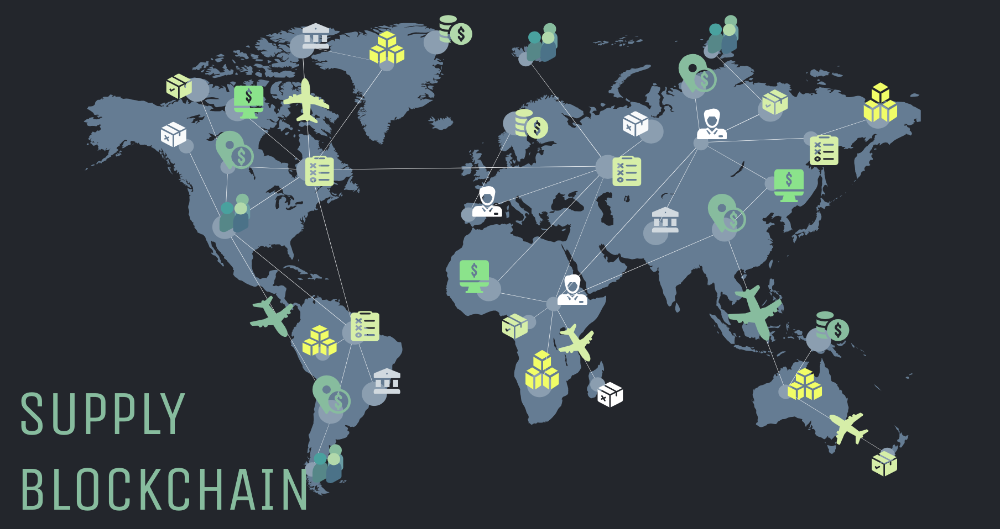
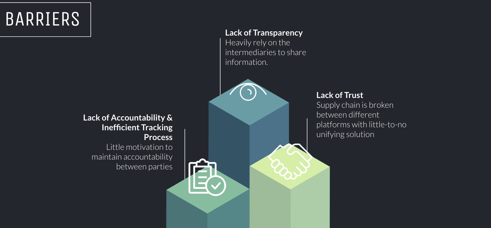
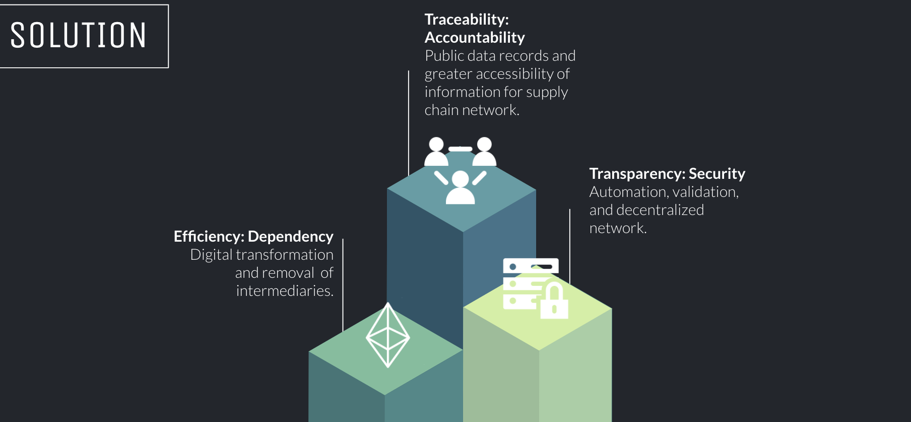
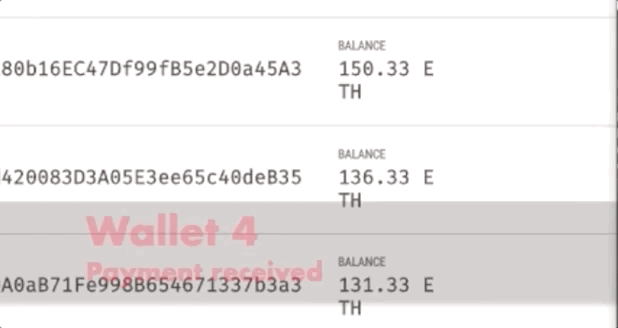
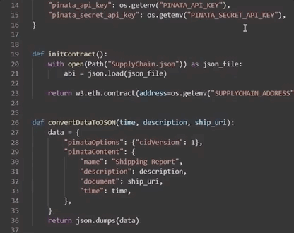
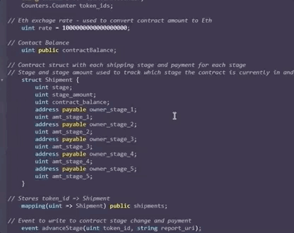

# Transforming Supply Chain Industry with Smart Contracts



*Project Team: Alexandra Dumitras-Geli, Carlos Ituarte, Ian Davies, and Musonda Yamfwa.*

**Project Presentation** can be found [here](https://docs.google.com/presentation/d/1ECOEC7irGC1phI2IZMtvSuyvmwWap4Wv92qfQ_tB6CI/edit?usp=sharing)

---

## Table of Contents

- [Project Objective](#Project-Objective)
- [Key Barriers impacting Traditional Supply Chain Model](#Key-Barriers-impacting-Traditional-Supply-Chain-Model)
- [Solution: Cue Smart Contracts & Blockchain](#Solution-Cue-Smart-Contracts-and-Blockchain)
- [Project Code](#Project-Code)
- [Installation Requirements](#Installation-Requirements)
- [File Contents](#File-Contents)
- [Resources and Troubleshooting](#Resources-and-Troubleshooting) 

---
## Project Objective

 

This project explores the use case of smart contracts and blockchain technology to remove the barriers within a supply chain.

The supply chain smart contract is intended to digitally facilitate, verify, and enforce the obligations each party has within the contract. Smart contracts allow the performance of credible transactions without third parties. In other words, by implementing a supply chain smart contract, it allows for improved transparency of delivery of goods and process payments based on the different stages completed by each party. 

The current supply chain model heavily relies on building transparency between parties through intermediaries (e.g. financial institutions or third party companies to facilitate the contract. Smart contracts and blockchain have great potential in greatly improving the logistics and supply chain management. 

Our project aims to show how the supply chain stages will be improved with smart contracts compared to the traditional supply chain model.

### Supply Chain Stages


1. Manufacturer - Land freight at origin

    *Manufacturer receives shipping contract and moves goods to freight.*

2. Cargo by Ship

    *Freight received at shipping port and is scheduled to be delivered to warehouse holding.*

3. Warehouse Holding

    *Container stored at warehouse shipping port.*

4. Land freight at destination 

    *Goods collected by transportation company and in transit to customer.*

5. Customer receives freight

    *Customer receives delivery in the agreed upon time.*

---

## Key Barriers impacting Traditional Supply Chain Model

As shown in the image below, the traditional supply chain has a number of inefficiencies that negatively impacts the industry as the barriers slow down the process and does not allow for all parties to be privy to all transaction information and tracking. 



**Lack of Transparency:** 

Due to the use of third party companies, the parties within the supply chain heavily rely on  the intermediaries to share information related to the goods sent from manufacturer-carrier-customer. The parties do not have full visibility on information and there is a risk of not receiving important information in a timely manner.

**Lack of Accountability & Inefficient Tracking Process:** 

With a lack of transparency within the supply chain, it reduces the motivation to maintain accountability between parties as accountability is broken between the stages. There is no overall system or platform where all parties can view and stay informed of all the shipping stages. This adds an increased risk of lost goods between transfers. 

 

**Lack of Trust:** 

The supply chain network is broken between third party companies, manufacturers, carriers, and customers with no unifying solution and/or platform. Equally: (1) Manufacturers need their customers to trust that they will complete their order on time at an agreed price, (2) manufacturers need to trust their transportation company to deliver the goods within the agreed terms, and (3) manufacturers need to trust their customers to complete payments in line with agreed terms. With the use of third party companies, parties do not receive full trust.

---

## Solution Cue Smart Contracts and Blockchain



**Traceability: Accountability** 

Transitioning from traditional supply chain systems provides greater traceability. Blockchain networks keep track of detailed data records throughout the transition of the goods journey. Once data records are created on the public blockchain, they can rarely be altered and/or removed from the chain. Therefore, despite multiple parties being involved in the supply chain process, detailed data is chronologically stored and organized on the blockchain whilst providing greater accessibility to those who have access to the network. The increased traceability blockchain technology offers on the supply chain indicates members of the chain have greater accountability to ensure quality control and improve transparency. The feature of traceability allows interested parties to investigate issues, fraudulent activities, and sub-par fulfillment to the correct owner of the problem at hand. Overall, the benefits of detailed record keeping, and permanent storage and accessibility within the chain has the potential to drastically increase suppliers performance within each stage of the supply chain because the element of traceability introduces a greater level of accountability. 

**Efficiency: Dependency**



Utilizing blockchain technology allows traditional supply chain processes to experience much needed digital transformation to allow companies and their partners enter the era of “Supply Chain 4.0.” In its simplest form, blockchain technology provides an open, decentralized network generating accessibility to the market traditional processes could not provide due to the once necessary intermediaries. Banks, lenders, customs, logistic agents, and the continuing list of involved parties within the supply chain have introduced several clerical requirements throughout the development of the supply chain resulting in a lengthy and tedious process. Essentially, resulting in decreasing trust, communication, and capital shared between suppliers and vendors. The two primary components of blockchain technology; decentralization and cryptographic essence introduces peer-to-peer transactions, resulting in benefits such as; payment and communication efficiency, reliability, dependency, and trust. Each of these resolutions provided by blockchain technology stem from the efficiency element it provides firms operating in the “Supply Chain 4.0.” Features such as smart contracts execute computer programmed code automating verification, trigger payments, inventory records, shipment notifications, etc. eliminating the dependency on third-parties. This form of automation executes parameters within the contract agreement once requirements are fulfilled and accounted for. This process entirely removes the dependency on the middleman driving markup costs and delays within the traditional supply chain. 

**Transparency: Security**


Automation, validation, and decentralization on a public blockchain derives a new vision of transparency within the supply chain network. Historical data tracking and detailed records of digital transactions collected in blocks within an encrypted network minimizes the noise present in the traditional supply chain. Meaning, if parties with malicious intent attempt to alter or falsify records, hackers would have to modify the specified block and all proceeding blocks present in the ledger's history. Thus, if members of the supply chain wish to alter or modify records within the blockchain it will be detected and must be approved by another partner within the given supply chain. This establishes a transparent, open line of communication between supply chain partners because modifying or updating information on the blockchain requires approval from the other participants on the supply-blockchain. Thus, each partner is responsible for providing accurate and clean data to avoid potential concerns that may arise from other partners within the supply chain when data modification requests are inputted. This also provides greater security offered in decentralized networks. Data record copies are contained in several nodes on the blockchain to avoid data tampering and potential fraudulent activities that have a greater chance of occurring in a centralized data system. Additionally, features in smart contracts minimize the occurrence of duplicate entries, errors, or records containing false information. Therefore, the blockchain system improves the expected transparency between supply chain partners to conduct efficient and reliable transactions by aligning priorities within the partnership. 

---

## Project Code

  

Details on the project code and user deployment can be found [here](source_code/Supply_Chain_User_Guide.md)


User's can watch a live proejct demo video by navigating to the mp4 titled ```Supply Blockchain```

---

## Installation Requirements

 

To successfully run the code, the following installations are required:

[Remix Ethereum](https://remix.ethereum.org/) 

[Ganache](https://www.trufflesuite.com/ganache)

[MetaMask](https://metamask.io/)

An additional installation guide located in the ```Source Code``` directory can be found [here](source_code/unit-20-install-guide.md)

---

## File Contents 

```Located in the Source Code Directory```

- [Supply Chain User Guide](source_code/Supply_Chain_User_Guide.md)
- [Kovan Test Case](source_code/Kovan_Test_Cases.md)
- [Log Shippment](source_code/logShipment.py)
- [Supply Chain Sol File](source_code/SupplyChain.sol)
- [Supply Chain PY File](source_code/supplychain.py)

---


## Resources and Troubleshooting 


We experienced issues with completing transactions with ethereum within our smart contract ensures after each stage completed, payment is made accordingly. 

Please use the following troubleshooting guide below:

[Ethereum Function within Smart Contract](https://ethereum.stackexchange.com/questions/46107/how-do-you-send-ether-as-a-function-to-a-contract-using-remix)

---
