# Kovan Supply Chain Smart Contract Test Cases

This document contains the test cases used to verify the execution and functionality of the Supply Chain Smart Contact.  The contract has set up to employ the interfaces, contracts, and utilities related to the [ERC721 Non-Fungible Token Standard](https://eips.ethereum.org/EIPS/eip-721).

---

## Table of Contents
- `Supply Chain Deployment Requirements`
- `Contract Setup`
- `Stage 1 Test`
- `Stage 2 Test`
- `Stage 3 Test`
- `Stage 4 Test`
- `Stage 5 Test`

---

## `Supply Chain Deployment Requirements`

Following will be required to deploy and run the contract.  

1. [MetaMask](https://metamask.io/) - web browser extension that allows you to run Ethereum dApps.    
2. [Ganache](https://www.trufflesuite.com/ganache) - a personal blockchain for Ethereum development where contracts can be deployed, developed and run tests  
3. [Remix IDE](https://remix.ethereum.org) - open source tool that helps you write Solidity contracts

Contract was successfully deployed using Ganache blockchain by connecting to Injected Web3 on Remix, conducting transactions through MetaMask under the Kovan test network.  Contact address 0x587C3B71853d9ce605A7B8fd04AEa0647BfbB0BA

---

## `Contract Setup`

A test contract was setup using the following addresses, stage amounts and URI's.  Contract value was set to 6 Ethereum with the below distributions.

1. Contract Owner 
    - Address: 0xF1F47c0f63B98675bd2441589237E4fBD6050eEe
    - Report URI:	ipfs://bafybeihvhzixuw3klmhxwptudorlhoy2bqqn5nrwzwwlj2aefhqr67ifvm   
    - Contract Value: 6 Ethereum  

2. Stage One Owner
    - Address: 0xa7277D5d99C66733a403C5E1D6cf83BBf9E54BF6
    - Report URI:	ipfs://bafybeif43qcht2dshd6qbhwf33oyc7dcvkihs7obnai4yoq7kbqty5j6wq
    - Payment: 1 Ethereum

3. Stage Two Owner
    - Address: 0xe53e90Dc01Bb61782A8E54AE368151dfc8E1e2c4
    - Report URI:	ipfs://bafybeiap6mb5nr5fshrlo6j42e4dvocsbpzsrapiucl55ygcq7zm2ci2by
    - Payment: 2 Ethereum

4. Stage Three Owner
    - Address: 0x8bDdA2C3a9ece5ceD74c146f50e151aBc8264213
    - Report URI:	ipfs://bafybeiajb3y3nom7la72h6brgzmd3ixexgn7hr32udsiljxf6bnmousjvy
    - Payment: 1 Ethereum

5. Stage Four Owner
    - Address: 0xa78be32A132e4184E154496f0a1b0Bbd7350066d
    - Report URI:	ipfs://bafybeid7qoqjzut6zxlksqpotzpacdq4i4idgoje7yumxb2sogqc64slqe
    - Payment: 1 Ethereum

6. Stage Five Owner
    - Address: 0x5ee47ADabCCd68d28F95542F2710DBbDFEfE0CD1
    - Report URI:	ipfs://bafybeieui7x4jp7rgqalqtljptm45s4m6ezjkgh7npttosdpd5pvlq3bli
    - Payment: 1 Ethereum

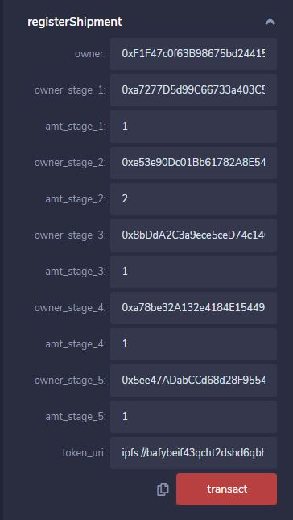       

When the contract is created, a transaction will be executed against the owners account, reducing the owners account by the amount of the contract 6 Ethereum.  

Owners Opening Balance     
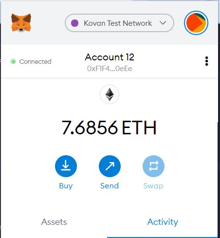              

Once the transaction is completed, contract status will be:     
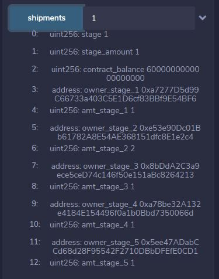     

Owner Balance After Contract Transaction     
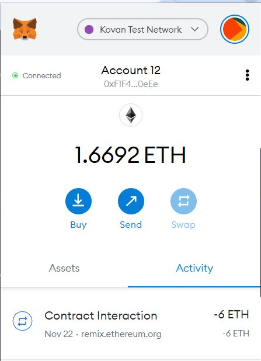     

Kovan Network Transaction       
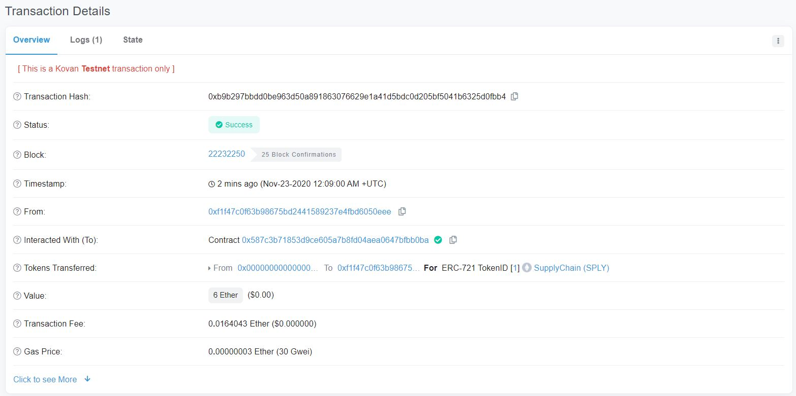   

---

## `Stage 1 Test`

First test case is to simulate the completion of stage 1 and payment to the owner of stage 1.  Expected results is to have the contract advance to the next stage, payment of 1 Ethereum to stage 1 owners account and the contact balance to decrease by the stage 1 amount.

Stage 1 Owners Opening Balance     
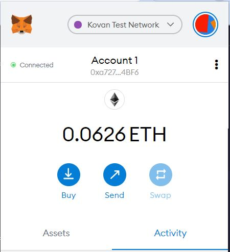 

Log Shipment via reportShipment     
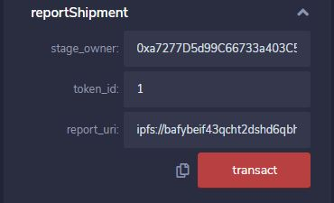     

Once the transaction is completed, contract status will be:     
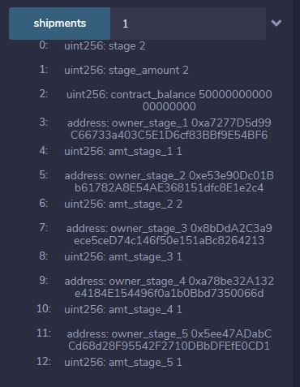     

Stage 1 Owners Balance After Contract Transaction     
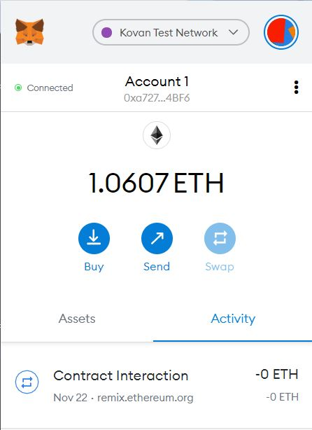     

Kovan Network Transaction       
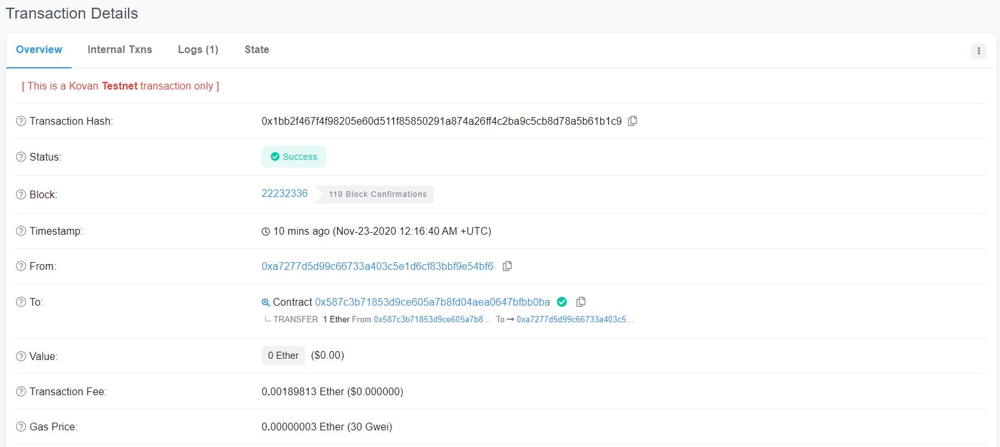 

---

## `Stage 2 Test`

Next test case is to execute a transaction for stage 2 with expected results to have the contract advance to the next stage, payment of 2 Ethereum to stage 2 owners account and the contact balance to decrease by the stage 2 amount.

Stage 2 Owners Opening Balance     
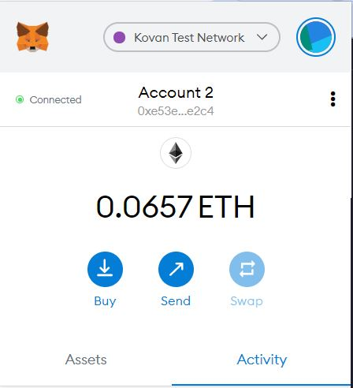 

Log Shipment via reportShipment     
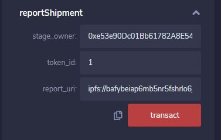     

Once the transaction is completed, contract status will be:     
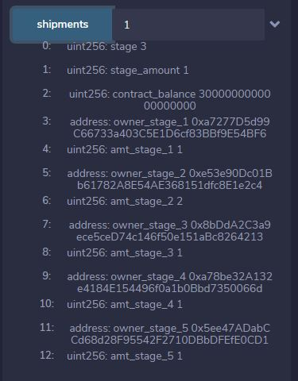     

Stage 2 Owners Balance After Contract Transaction     
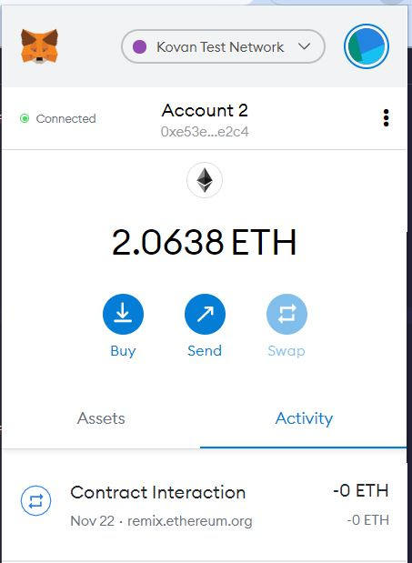     

Kovan Network Transaction       
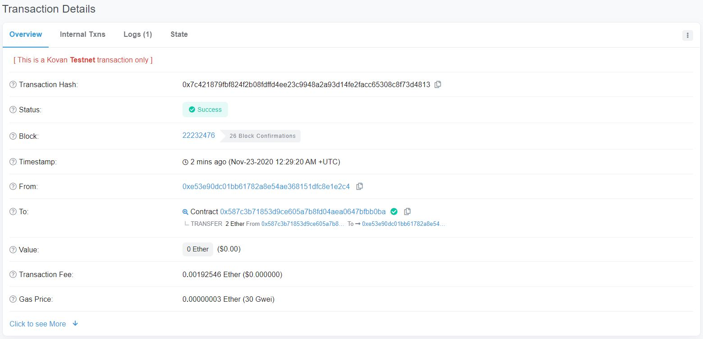 

---

## `Stage 3 Test`

Same as the test for stage 2 expected results for stage 3 is to advance to the next stage, payment of 1 Ethereum to stage 3 owners account and the contact balance to decrease by the stage 3 amount.

Stage 3 Owners Opening Balance     
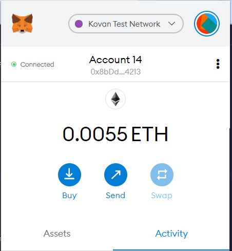 

Log Shipment via reportShipment     
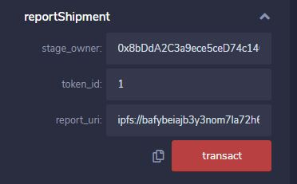     

Once the transaction is completed, contract status will be:     
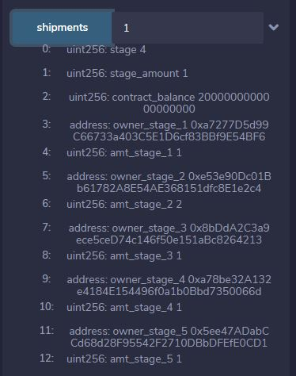     

Stage 3 Owners Balance After Contract Transaction     
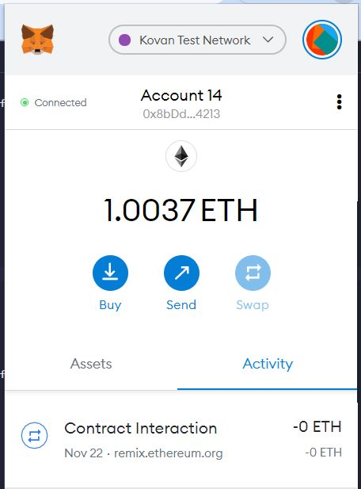     

Kovan Network Transaction       
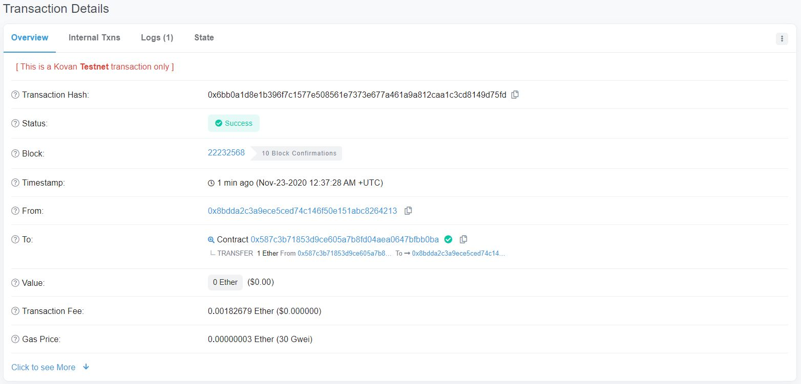 

## `Stage 4 Test`

As with the above cases, excepted results for stage 4 is have the contract advance to the next stage, payment of 1 Ethereum to stage 4 owners account and the contact balance to decrease by the stage 4 amount.

Stage 4 Owners Opening Balance     
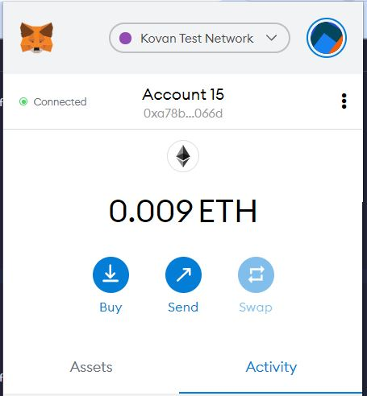 

Log Shipment via reportShipment     
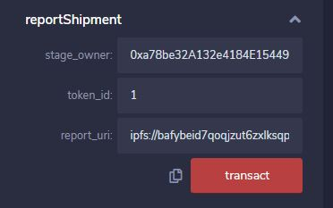     

Once the transaction is completed, contract status will be:     
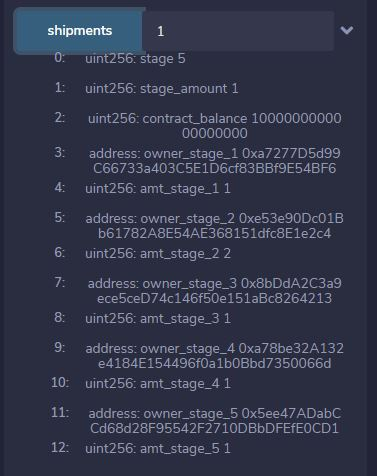     

Stage 4 Owners Balance After Contract Transaction     
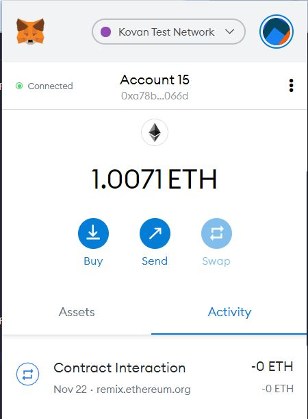     

Kovan Network Transaction       
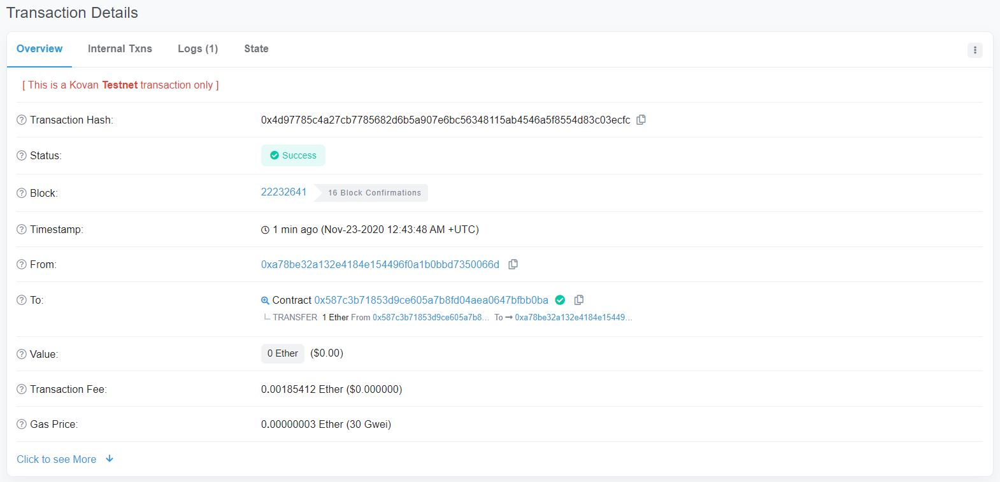 

## `Stage 5 Test`

In the final transaction of the contract, again we expecting payment of 1 Ethereum to stage 5 owners account and the contact balance to decrease by the stage 5 amount with the contract balance set to zero.  Setting the contract balance to zero with signal the closure of the contract.  Also, the stage will be set to zero along with the stage balance. 

Stage 5 Owners Opening Balance     
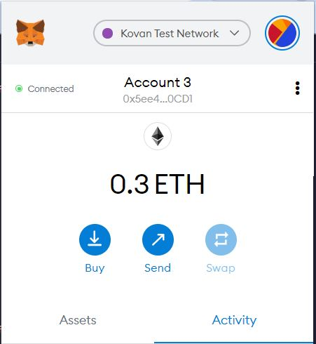 

Log Shipment via reportShipment     
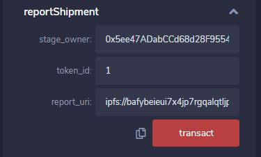     

Once the transaction is completed, contract status will be:     
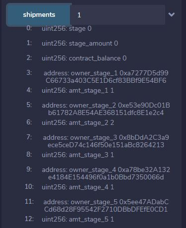     

Stage 5 Owners Balance After Contract Transaction     
     

Kovan Network Transaction       
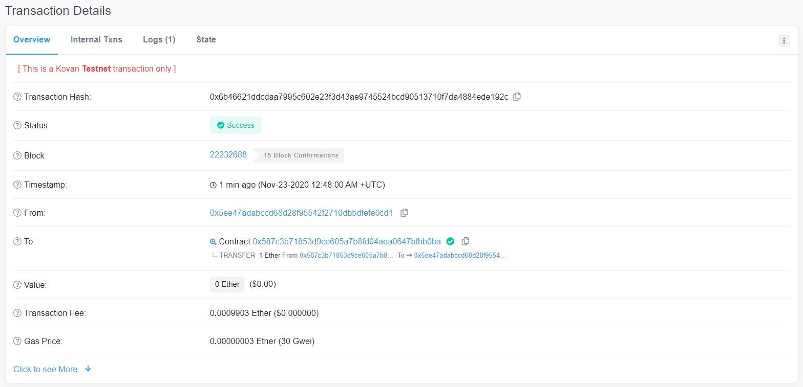 

