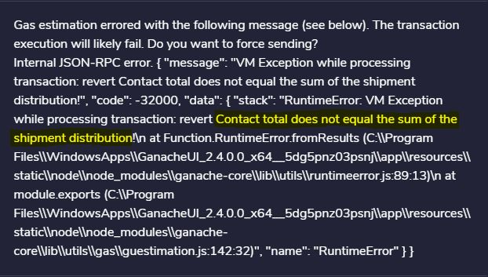
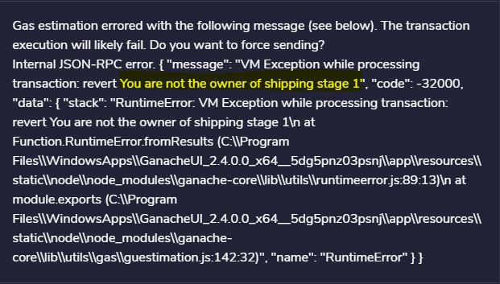
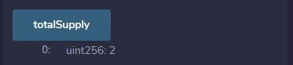

# Setting Up the Supply Chain Smart Contract

This guide provides instruction on how to set up a `Supply Chain` Block chain that will create any number of shipping contracts.  In the contracts you will be able to  report on the current shipping status of the contract and log shipment or stage payments.  The contract has set up to employ the interfaces, contracts, and utilities related to the [ERC721 Non-Fungible Token Standard](https://eips.ethereum.org/EIPS/eip-721).

---

## Table of Contents
- `Dependencies and Required Tools`
- `Contract Files and Setup`
- `Contract Criteria`
- `Create Supply Chain Contract`
- `Log Shipment`
- `Command Line Interface`
- `Other Options`
- `Kovan Test Cases`

---

## `Dependencies and Required Tools`

Following will be required to deploy and run the contract.  

1. [MetaMask](https://metamask.io/) - web browser extension that allows you to run Ethereum dApps.    
2. [Ganache](https://www.trufflesuite.com/ganache) - a personal blockchain for Ethereum development where contracts can be deployed, developed and run tests  
3. [Remix IDE](https://remix.ethereum.org) - open source tool that helps you write Solidity contracts 

Installation guide for the above tools can be found in the following [Installation Guide](unit-20-install-guide.md)

Contract files are located at the following GitHub location and will need to be downloaded.

[Supply Chain Contract](https://github.com/adgeli/The_Supply_Blockchain.git) - supply chain contract data files

In order to run the command line interface, the following imports will be need to be installed.

1. [`Pandas`](https://pandas.pydata.org/pandas-docs/stable/getting_started/install.html)
2. [`date`](https://docs.python.org/3/library/datetime.html)
3. [`datetime`](https://www.w3schools.com/python/python_datetime.asp)
4. [`pprint`](https://docs.python.org/3/library/pprint.html)
5. [`bit`](https://ofek.github.io/bit/) Python Bitcoin library.    
6. [`web3.py`](https://github.com/ethereum/web3.py) Python Ethereum library. 

---

## `Contract Files and Setup`

* [`SupplyChain.sol`](SupplyChain.sol) — Supply chain / block chain contract file.

* [`supplychain.py`](supplychain.py) — Link file between the Contact file and command line interface.

* [`SupplyChain.json`](SupplyChain.json) — Jason version of the contract used with the command line interface.

* [`logShipment.py`](logShipment.py) - Command line interface to interact with the Supply Chain contract.

* [`.env`]() - this file is not provide but will be required to be setup.  The block chain will be using the IPFS services of [`Pinata`](https://pinata.cloud/) to record and store shipping documents using URI's. The following connection properties will need to be added to the `.env` file for contract functionality.

    - `PINATA_API_KEY` - set to the account key provided by Pinata
    - `PINATA_SECRET_API_KEY` - set the private account key provided by Pinata
    - `WEB3_PROVIDER_URI` - web address hosting the contract.  Set to local host for testing.
    - `SUPPLYCHAIN_ADDRESS` - address of the deployed contract

---

## `Contract Criteria`

Before the contract can be setup, there are requirements and criteria that must be adhered to.  If these are not meet the contract cannot be created or shipping stage payments made.  Errors will display if the criteria are not meet.

1. During the contract setup, the amount paid into the contract must equal the total amount paid to each stage.  Following error will display if not set up correctly.

2. Only a stage owner can log a stage completion and payment.  If someone other then the owner attempts to log a shipment or payment the following error will occur.    

2. Supporting documentation URI must be provided.  Documentation is proof of stage completion
3. Once the contract balance hits zero and stages completed, the contract is fulfilled.  No further payments can be logged.  If an attempt is made to log a stage completion when the contract is complete, the following error will display

---

## `Create Supply Chain Contract`

Once the Supply Chain has been deployed, a shipping contract will need to be setup. This is accomplished via the `reportShipment` function of the contract.  Ethereum is accepted into the contract representing the total amount of all stages of the shipping process. The amount of each stage should not exceed the total amount of Ethereum entered.  Setup begins with adding the contract's owner wallet address, then enter the stage owner’s wallet addresses for each stage of the shipping process with the amount to be paid for the stage.  Once all 5 stage owner's wallet addresses and amounts are entered, the supporting contract document URI is then added.  Note the total amount paid into the contract must equal all the stage amounts.  See item 1 in the criteria section.

---

## `Log Shipment`

With the contract now setup, stage completion can now be updated and payment logged for completion of each stage of the shipping process.  

As each stage is completed, the amount set for the stage is paid to the stage owner out of the contract total.  The contract total is decreased by the stage amount and will eventually hit a balance of zero when the final stage is reached.  Logging a stage completion and payment is executed via the `reportShipment` function.  The stage owners wallet address , contract id / token id and supporting document URI is entered.  When sumbitted the amount set for the stage is paid to the stage owner.

---

## `Command Line Interface`

Included with the Supply Chain contract is a command line interface.  This allows stage owners to log shipments or payments and generate status reports on the shipping contract.  To use the interface, download the contract files from `GitHub`.  Open a command window and navigate to the folder location where the files were copied.  

From the interface there are two command that can be performed.  The first is logging a shipment which calls the `reportShipment` function of the contract.  The second is a report option that displays the current status of the contract.

1. `log` - to log a completed stage and shipping payment, in the command window enter the following `python logShipment.py log`.  You will be prompted for the following information:

Prompts:   

Date - date of the transaction in MM-DD-YYYY format   
Description of the Shipment - indicate which stage is being logged and any other important info.
Owner ID / Address - stage owner wallet address   
Contract / Token ID - token id or contract id   
Enter Shipping/Document URI - URI location of supporting documentation   

Once all the prompts have been filled, the stage owner will be paid the stage amount that was set during the contract setup, stage amount will be subtracted from the total contract amount and the contract stage will be advanced to the next stage waiting for its competition.  In addition, a transaction receipt is displayed containing gas expense used and block information.

2. `report` - a report of the current status on the contract at any given time by entering in the command window enter the following `python logShipment.py report`.  You will be prompted for the following information:

Prompts:    
Contract / Token ID - token id or contract id

A screen report will display indicating what stage the contract is in, amount due for the stage, balance of the contact plus summary details of the block.

---

## `Other Options`

Other functions are available in the block that can provide additional information such as contact name, symbol and owner by selecting the following buttons.

     
  

Using the contract ID / token ID, the status of the specified contract can be display using the shipments button.  This button will show stage owners and stage amount, what stage the contact is currently in and the amount owing plus the contact balance.

Finally; at any given time, a contact balance and the number of contacts in the block chain can be determined with the following buttons.

     

---

## `Kovan Test Cases`

The contract was built, deployed and tested first on a local Ganache blockchain by connecting to Injected Web3 on Remix, conducted through MetaMask under localhost:8545. After tests were completed locally, the contracts were then successfully deployed and tested on the Kovan network. Test results can be found in the [`Kovan Test Case`](Kovan_Test_Case.md)

